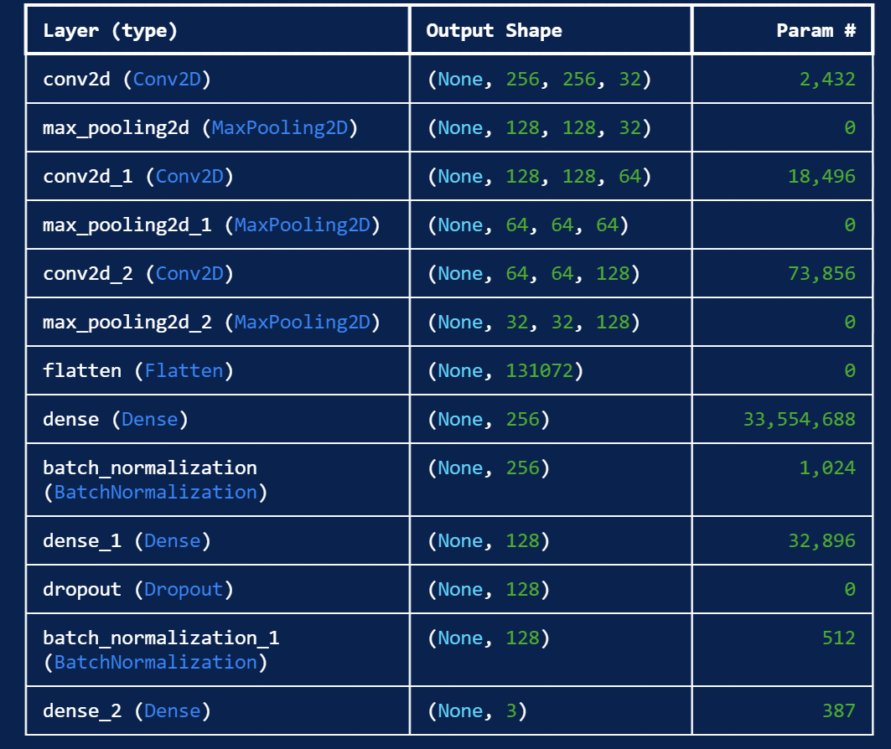
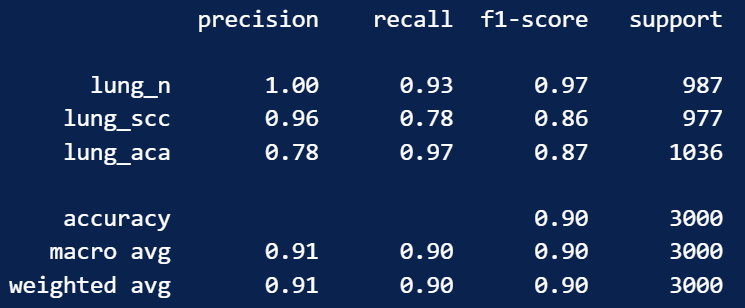

# **Cancer Detection Project**

## Overview
This project aims to develop a machine learning model to detect cancer from histopathological images. Early detection of cancer is critical for improving treatment outcomes and survival rates.

## Prerequisites

Ensure that the following libraries are installed:

- `numpy`
- `pandas`
- `matplotlib`
- `scikit-learn`
- `tensorflow`

You can install them using the following command:

`pip install -r requirements.txt`

## Getting Started
Clone this repository to your local machine:

```bash
git clone git@github.com:Shade9378/Cancer-Detection.git
cd Cancer-Detection`
```

## Data
The dataset used in this project is taken from: https://www.kaggle.com/datasets/andrewmvd/lung-and-colon-cancer-histopathological-images

## Model Description


## Evaluation Metrics
The model’s performance is evaluated using the following metrics:
- Precision: The proportion of true positive results among all positive predictions.
- Recall: The proportion of true positives identified by the model out of all actual positives.
- F1-Score: The harmonic mean of precision and recall.

## Results


## Acknowledgements 
This project is built with the guide of GeeksforGeek: https://www.geeksforgeeks.org/lung-cancer-detection-using-convolutional-neural-network-cnn/
